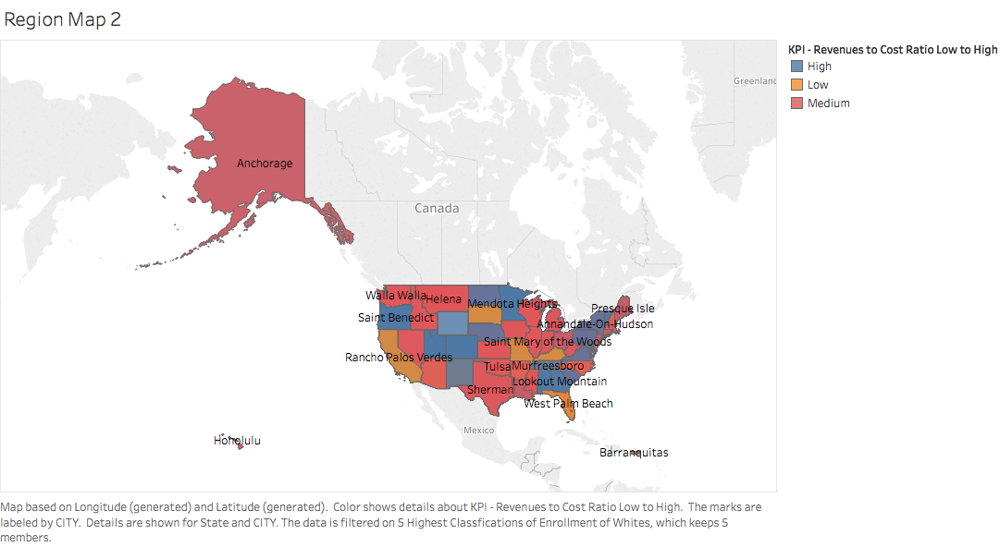

#**Introduction**
This is our R Notebook, showing the steps we took to complete Project 6 for CS 329E. This notebook includes step-by-step instructions on how to reproduce our project. To obtain our data, we used data.world. 

#**R Configuration**
Below we display our sessionInfo().

```{r sessionInfo}
sessionInfo(package=NULL)
```

#**Data Description**
Found in data.world, a customer based data set that looks at orders and shipments from different markets around the world.

#**Cleaning Data**
Here's our ETL file to clean our data set.

```{r}
source("../01 Data/R_ETL.CollegeScorecard.R")
```

#**Cleaned up Data Download**
Cleaned data can be downloaded from Data.world as a .csv file. Because the dataset is so large, we filtered to only show some rows.

Hosting User: jlee</br>
Database: S17 DV Project 6</br>
Dataset Name: globalshipments.csv

Download Link: https://query.data.world/s/d0wreeo0o94v85mxb6790cb21

```{r}
source("../01 Data/Accessdataworld.R")
```


#**Side by Side Shiny and Tableau Visualizations**
**Descriptions:** Refer to visualization captions for individual descriptions.</br></br>
<b>Boxplot: Average Cost of Attendance for Type of School</b> </br></br>
.png){ width=49% }
{ width=49% }
These boxplots (Tableau left, Shiny right) dfddf</br></br>

<b>Histogram: SAT Averages for Universities</b> </br></br>
.png){ width=49% }
{ width=49% }
These histograms (Tableau left, Shiny right) dfddf</br></br>

<b>Scatterplot: Instructional Expenditures vs. Net tuition</b> </br></br>
.png){ width=49% }
{ width=49% }
These scatterplots (Tableau left, Shiny right) explore the correlation between Instructional expenditures per full-time equivalent student and Net tuition revenue per full-time equivalent student.
</br></br>


<b>Crosstab 1: BLABLALBLA</b> </br></br>
.png){ width=49% }
{ width=49% }
These crosstabs (Tableau left, Shiny right) xxxx
</br></br>

<b>Crosstab 2: BLABLALBLA</b> </br></br>
{ width=49% }
{ width=49% }
These crosstabs (Tableau left, Shiny right) xxxx
</br></br>

<b>Map 1: BLABLALBLA</b> </br></br>
.png){ width=49% }
{ width=49% }
These maps (Tableau left, Shiny right) xxxx
</br></br>

<b>Map 2: BLABLALBLA</b> </br></br>
{ width=49% }
{ width=49% }
These maps (Tableau left, Shiny right) xxxx
</br></br>


#**Tableau / Tableau Action Generated Visualizations**
**Descriptions:** Refer to visualization captions for individual descriptions.
Tableau generated barcharts. </br></br>
<br><br><br>

Tableau generated ID sets.</br></br>
<br><br><br>
{ width=20% }

#**Shiny Visualization and Published Application**
**Description:** A static .png of the Shiny application, as well as a link to the live published version.<br>

Barchart1: Sum of Discount for each Ship Mode broken down by Region. Marks are labeled by Calculated Difference from Average for Discount and sum of Discount. The data is filtered on Country, which keeps United States.<br>

Barchart2: Sum of shipping cost for each Sub-Category broken down by Region. Marks are labeled by Calculated Difference from Average for Shipping Costs and sum of Shipping Cost. The data is filtered on Country, which keeps United States.</br>

Barchart 3: Sum of sales over population for each segment broken down by region. The marks are lebeled by sum([sales]/[population]) and calculated difference for sales over population. The data is filtered on country, which keeps united states.</br>

Published Link:</br>
https://frannyfang.shinyapps.io/Barchart1/</br>

Barchart1
{ width=20% }</center>
