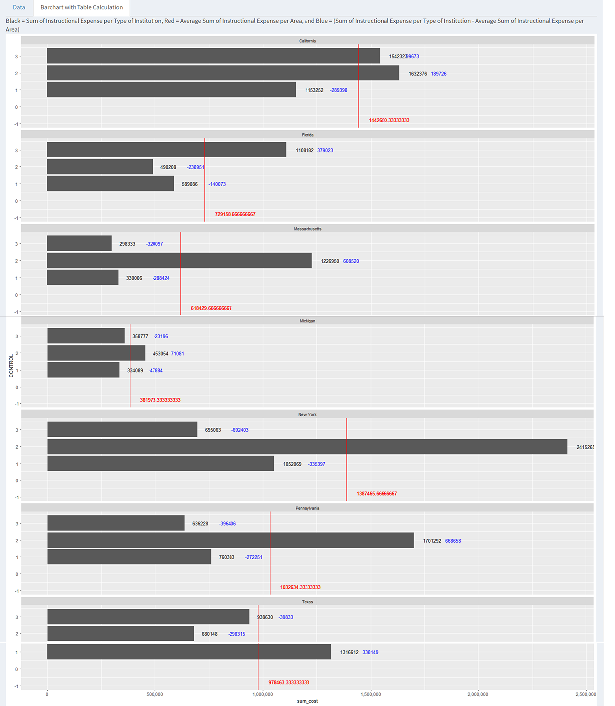

#**Introduction**
This is our R Notebook, showing the steps we took to complete the Final Project for CS 329E. This notebook includes step-by-step instructions on how to reproduce our project. To obtain our data, we used data.world. 

#**R Configuration**
Below we display our sessionInfo().

```{r sessionInfo}
sessionInfo(package=NULL)
```

#**Data Description**
The data was found on "Dr. John Rasp's Statistics Website" (http://www2.stetson.edu/~jrasp/data.htm). It is a subset of the data from College Scorecard, a Department of Education website that gives data on various variables regarding tuition, costs and school performance. </br>

An explanatory key for the recorded variables can be found here: https://data.world/jlee/s-17-dv-final-project/file/CollegeScorecard_ColumnNames.pdf </br>

#**Cleaning Data**
Here's our ETL file to clean our data set.

```{r}
source("../01 Data/R_ETL.CollegeScorecard.R")
```

#**Cleaned up Data Download**
Cleaned data can be downloaded from Data.world as a .csv file. Because the dataset is so large, we filtered to only show some rows.

Hosting User: jlee</br>
Database: S17 DV Final Project</br>
Dataset Name: CollegeScorecard.csv

Download Link: https://query.data.world/s/dv5dl8q1jx2qb3d3bd2976b9d

```{r}
source("../01 Data/Accessdataworld.R")
```


#**Side by Side Shiny and Tableau Visualizations**
**Descriptions:** Refer to visualization captions for individual descriptions.</br></br>
<b>Boxplot: Average Cost of Attendance for Type of School</b> </br></br>
.png){ width=49% }
{ width=49% }
These boxplots (Tableau left, Shiny right) demonstrate </br></br>

<b>Histogram: SAT Averages for Universities</b> </br></br>
.png){ width=49% }
{ width=49% }
These histograms (Tableau left, Shiny right) dfddf</br></br>

<b>Scatterplot: Instructional Expenditures vs. Net tuition</b> </br></br>
.png){ width=49% }
{ width=49% }
These scatterplots (Tableau left, Shiny right) explore the correlation between Instructional expenditures per full-time equivalent student and Net tuition revenue per full-time equivalent student.
</br></br>


<b>Crosstab 1: Instructional Expenditures / Cost of Attendance</b> </br></br>
.png){ width=49% }
{ width=49% }
These crosstabs (Tableau left, Shiny right) xxxx
</br></br>

<b>Crosstab 2: Tuition Revenue / Total Cost</b> </br></br>
.png){ width=49% }
{ width=49% }
These crosstabs (Tableau left, Shiny right) xxxx
</br></br>

<b>Map 1: Region Cost of Attendance (Instructional Expenditures / Cost of Attendance)</b> </br></br>
.png){ width=49% }
{ width=49% }
These maps (Tableau left, Shiny right) demonstrate the distribution of instructional expenditure / cost of attendance ratio across the United States, where darker colors indicate higher ratios.

</br></br>

<b>Map 2: Tuition Revenue to Total Cost</b> </br></br>
.png){ width=49% }
{ width=49% }
These maps (Tableau left, Shiny right) demonstrate the distribution of tuition revenue / total cost ratio across the United States, where darker colors indicate higher ratios. 
</br></br>


<b>Barchart: Instructional Expense per Type of Instutition</b> </br></br>
.png){ width=30% }
.png){ width=30% }
{ width=30% }</br>
These barcharts (Tableau left, Shiny right) xxxx
</br></br>

#**Shiny Visualization and Published Application**
**Description:** Full size static .pngs of the Shiny application, as well as a link to the live published version.<br>

Published Link:</br>
https://ehjkim.shinyapps.io/shinyfinal/</br>

Boxplot: Average Cost of Attendance for Type of School</br></br>
<br><br><br>

Histogram: SAT Averages for Universities</br></br>
<br><br><br>

Scatterplot: Instructional Expenditures vs. Net tuition</br></br>
<br><br><br>

Crosstab 1: Instructional Expenditures/Cost of Attendance</br></br>
<br><br><br>

Crosstab 2: Tuition Revenue / Total Cost</br></br>
<br><br><br>

Map 1: Region Cost of Attendance (Instructional Expenditures / Cost of Attendance)</br></br>
<br><br><br>

Map 2: Tuition Revenue to Total Cost</br></br>
<br><br><br>

Barchart: Instructional Expense per Type of Instutition</br></br>
<br><br><br>


#**Tableau / Tableau Action Generated Visualizations**
**Descriptions:** Full size static .pngs of the tableau visualizations. Refer to visualization captions for individual descriptions.

Boxplot: Average Cost of Attendance for Type of School</br></br>
.png)<br><br><br>

Histogram: SAT Averages for Universities</br></br>
.png)<br><br><br>

Scatterplot: Instructional Expenditures vs. Net tuition</br></br>
.png)<br><br><br>

Crosstab 1: Instructional Expenditures/Cost of Attendance</br></br>
.png)<br><br><br>

Crosstab 2: Tuition Revenue / Total Cost</br></br>
.png)<br><br><br>

Map 1: Region Cost of Attendance (Instructional Expenditures / Cost of Attendance)</br></br>
.png)<br><br><br>

Map 2: Tuition Revenue to Total Cost</br></br>
.png)<br><br><br>

Barchart: Instructional Expense per Type of Instutition</br></br>
.png){ width=49% }
.png){ width=49% }<br><br><br>


</center>
